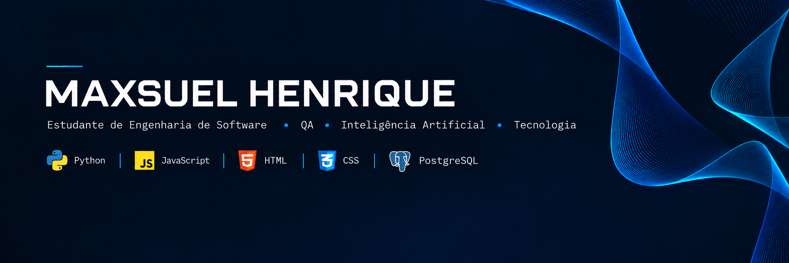

  

# Maxsuel Henrique

### `Estudante de Engenharia de Software` • `QA` • `Inteligência Artificial` • `Tecnologia`

---

## 🧑‍💻 Sobre mim

Sou estudante de **Engenharia de Software e Inteligência Artificial** , com forte interesse em Quality Assurance (QA) e Inteligência Artificial/Machine Learning.

Tenho interesse em entender como sistemas funcionam, explorar diferentes tecnologias e desenvolver uma base sólida para atuar na área de tecnologia.

Atualmente, venho estudando e praticando principalmente:

* 🐍 Python
* 🟨 JavaScript
* 🌐 HTML
* 🎨 CSS
* 🐘 PostgreSQL

Meu objetivo é transformar conhecimento em prática por meio de projetos, experimentação e aprendizado contínuo.

---

## ⚙️ Tecnologias

### Linguagens

### Web

### Banco de Dados

---

## 🚀 Projetos

> Meus projetos ainda não foram publicados no GitHub.
> Esta seção será atualizada conforme os projetos forem disponibilizados.

|     Projeto     |                Descrição               |        Status        |
| :-------------: | :------------------------------------: | :------------------: |
| 🔜 **Em breve** |       Projetos em desenvolvimento      | `Em desenvolvimento` |
| 🔜 **Em breve** |        Novos projetos e estudos        | `Em desenvolvimento` |
| 🔜 **Em breve** | Projetos voltados para tecnologia e QA | `Em desenvolvimento` |

---

## 🌐 Onde me encontrar

---

### `code` • `learn` • `test` • `improve`

 

  

**Construindo conhecimento, um commit por vez.**

